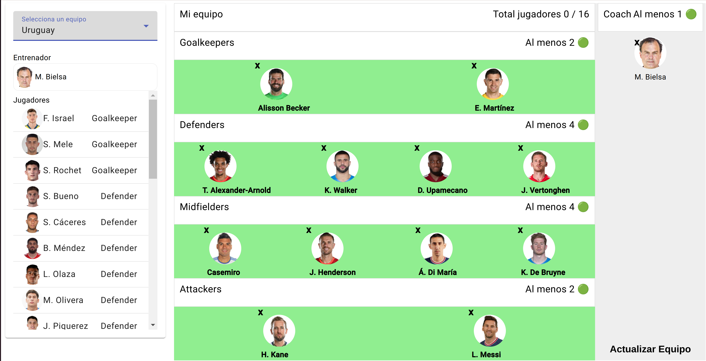

# FantasyFootball

This project was generated with [Angular CLI](https://github.com/angular/angular-cli) version 16.2.0.

## Development server

Run `ng serve` for a dev server. Navigate to `http://localhost:4200/`. The application will automatically reload if you change any of the source files.

## Code scaffolding

Run `ng generate component component-name` to generate a new component. You can also use `ng generate directive|pipe|service|class|guard|interface|enum|module`.

## Build

Run `ng build` to build the project. The build artifacts will be stored in the `dist/` directory.

## Running unit tests

Run `npm run test:watch` to execute the unit tests via **JEST**

## How use the app

We have the dashboard, we can see in the sidebar the players list and, 
in the content two inputs search (players and coach).

We can see the search league action, you need to write the league name with the highest possible specificity and do a click in your ideal option.

We can see the search player action, you need to write the player name with the highest possible specificity.

We can see a selected player after of searched.

We can see a selected coach after of searched.

## Important

Players belong to clubs, not nations. The decision was made because we do not have a search type endpoint to search for players by nations.

It is possible to use players based on nations with more engineering, studying other endpoints and matching objects in the UI, but it is not the idea way when we work. At a working level it is best to talk to the backend team to create a resource to help us in the UI.

